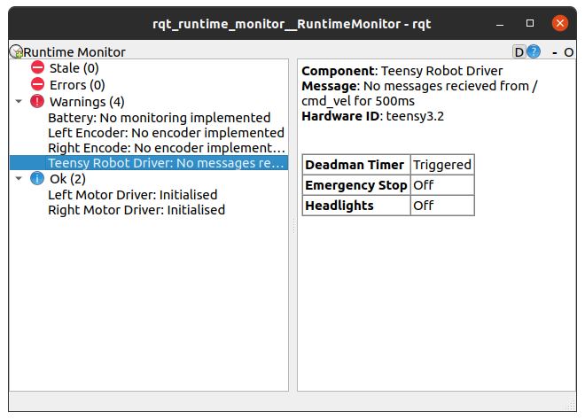

# Diagnostics

When looking into sending status info back from a micro-ros node I started to look into the diagnostic messages, and it turns out there are lots of tools for using these. As it seems like something we want to build in from the start I'm recording what I learn here. 

[Wiki with documentation](http://wiki.ros.org/diagnostics). There is a [ROS2 foxy ](https://github.com/ros/diagnostics/tree/foxy)branch on the repo. 

There are a number of [associated tools](http://wiki.ros.org/diagnostics) all in various states in relation to ROS2.

The [rqt\_robot\_monitor](http://wiki.ros.org/rqt_robot_monitor) package contains the robot\_monitor tool which displays the processed data from a diagnostic\_aggregator in graphical form.

For robots without a diagnostic\_aggregator, the [rqt\_runtime\_monitor](http://wiki.ros.org/rqt_runtime_monitor) package contains a simple monitor that displays data from the /diagnostics topic.

## Runtime Monitor

{% embed url="http://wiki.ros.org/diagnostics/Tutorials/Starting%20the%20Runtime%20Monitor" caption="ROS1 tutorial" %}

This is a simple way of viewing the raw diagnostic data. As the robot gets more complicated it is liekly that using the aggregator and robot monitor is more appealing.

As of 02/12/2020 there is a [merge request](https://github.com/ros-visualization/rqt_runtime_monitor/pull/5) to make this work in ROS2 but it has not been approved. 

I tested the [forked code ](https://github.com/pjreed/rqt_runtime_monitor/tree/dashing-devel)

```text
$ cd ros_ws/src
$ git clone https://github.com/pjreed/rqt_runtime_monitor.git --branch dashing-devel
```

Then build and source.

To run I had to 'force discover' as it was not found first time.

```text
$ ros2 run rqt_runtime_monitor rqt_runtime_monitor --force-discover
```

This works great and is all that is currently needed with the handful of messages I have. When pressing the deadmans switch on my controller I see the status switch between Ok and warning states.



## Micro-ros

Obviously on an embedded device we can't run these packages but we can publish in the correct format for it to integrate with the existing tools.

#### Existing message definitions:

* Whole robot status as array of DiagnosticStatus messages; [DiagnosticArray](http://docs.ros.org/en/api/diagnostic_msgs/html/msg/DiagnosticArray.html)
* Single status message from a individual component of the robot; [DiagnosticStatus](http://docs.ros.org/en/api/diagnostic_msgs/html/msg/DiagnosticStatus.html) 
* Single parameter from the individual component. Can have an array of these within your DiagnosticStatus; [KeyValue](http://docs.ros.org/en/api/diagnostic_msgs/html/msg/KeyValue.html)

Creating and filling in a message isn't super simple in micro-ros if it's not a basic type.


